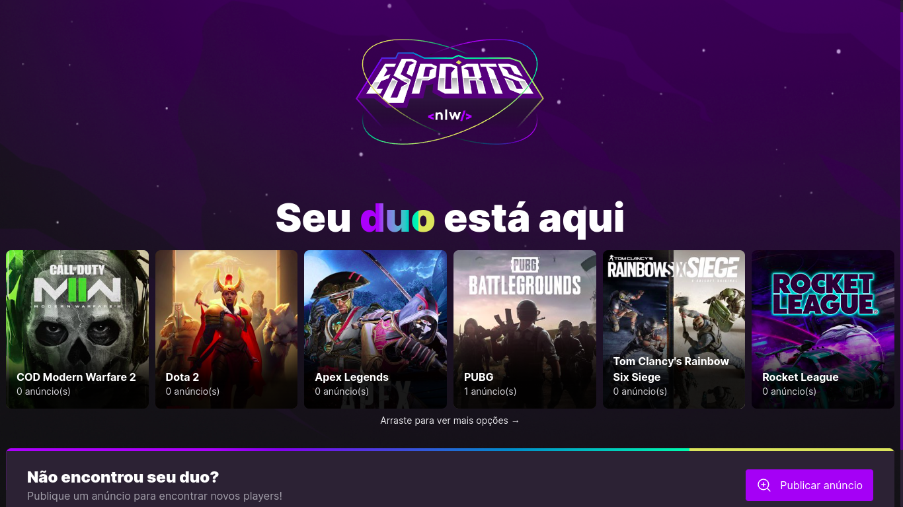
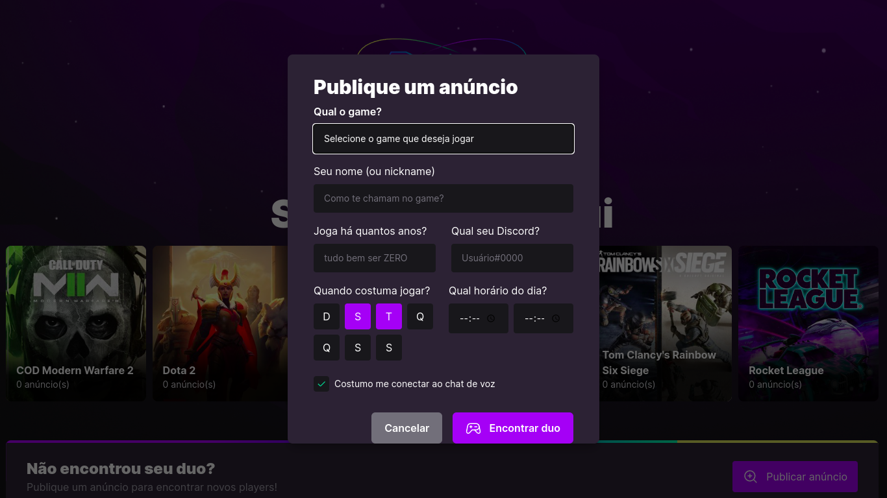
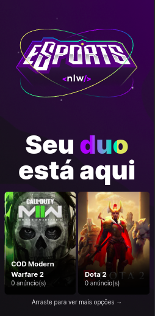
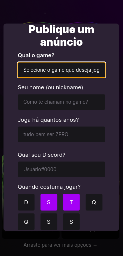

# DuoMatch App🚀

<p>
  Duo Match is a Web Platform and <a href="https://github.com/jovimoura/duoMatch-mobile">Mobile App</a> where players can find duos or even squads!
</p>

<p>
   Another thing, Duo Match has its own <a href="https://github.com/jovimoura/duoMatch-api">API</a>! 
</p>

<p>
  The project was made with Vite, React, Tailwind, TypeScript, Phosphoricons and Radix.
</p>

OBS: To run the project, U will need run the API to.

<br />

## Installation

### Clone

```
git clone https://github.com/jovimoura/duoMatch-app
```

### Access the folder

```
cd <name-folder>
```

### Install dependencies

```
npm i
```

### Start the app

```
npm run dev
```

### Port:

```
http://localhost:5173/
```

<br />

## Images of project

<br />

### Desktop:



<br >




### Responsive: 



<br >



<br />

## Tecnologies and Libs:

<ul>
    <li>Vite</li>
    <li>React</li>
    <li>TypeScript</li>
    <li>Tailwind</li>
    <li>Phosphoricons</li>
    <li>Radix</li>
    <li>Axios</li>
</ul>

<br />

## Made by:

### João Victor dos Santos Moura

### E-mail: joaovictors.mouraa@gmail.com

### Linkedin: https://www.linkedin.com/in/jovimoura10/
